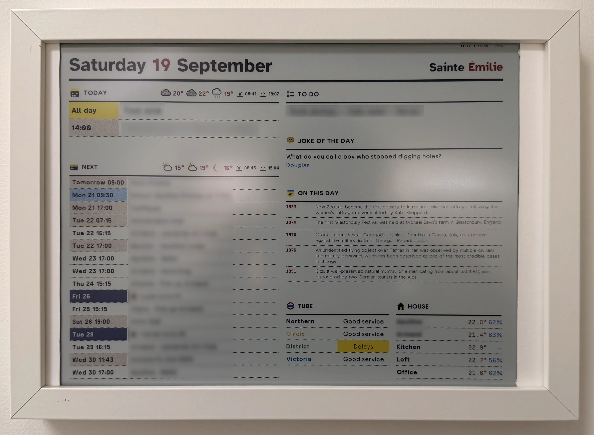
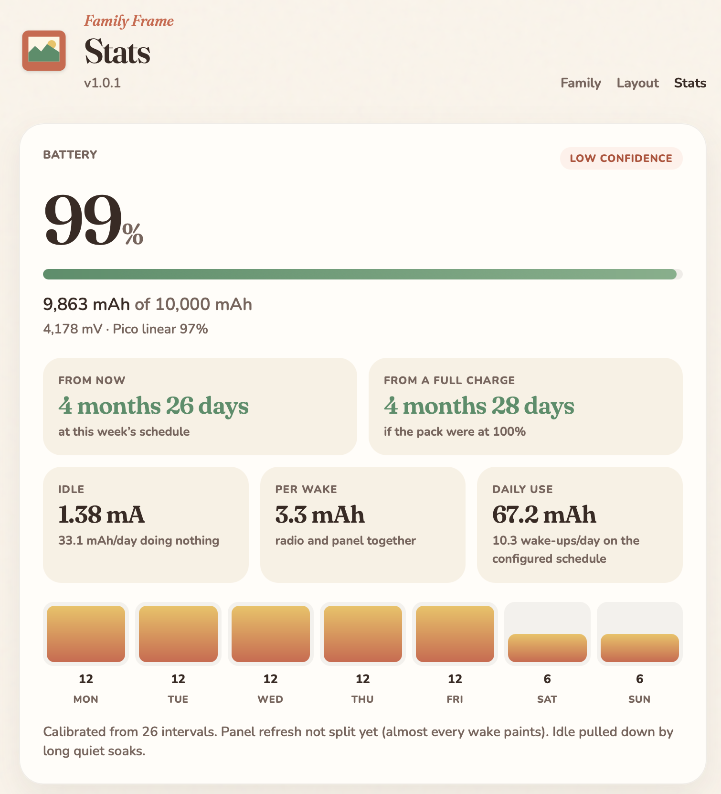
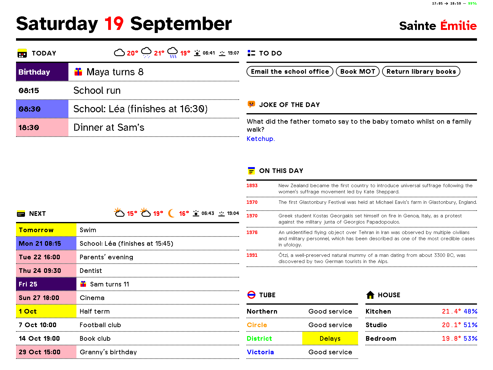
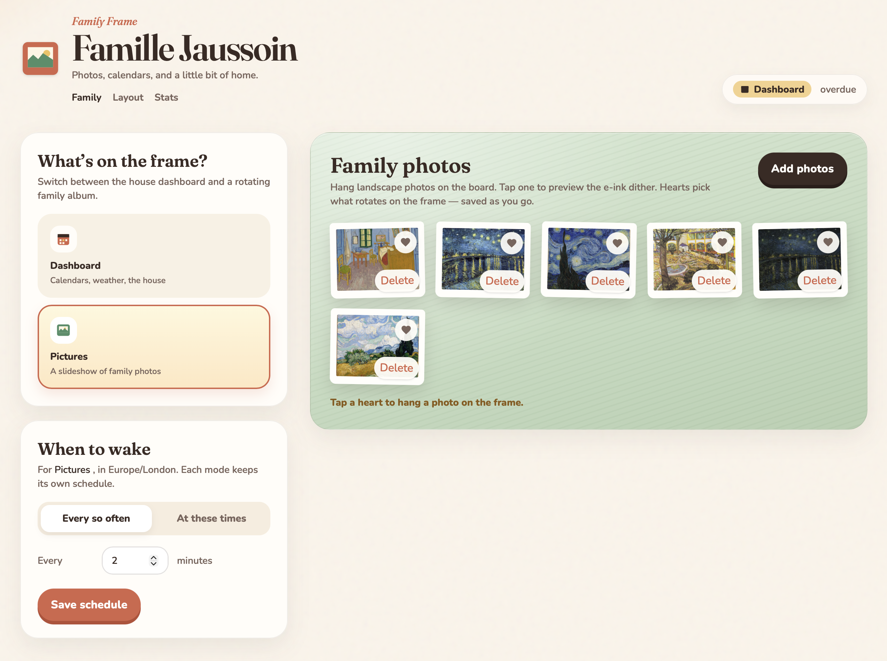
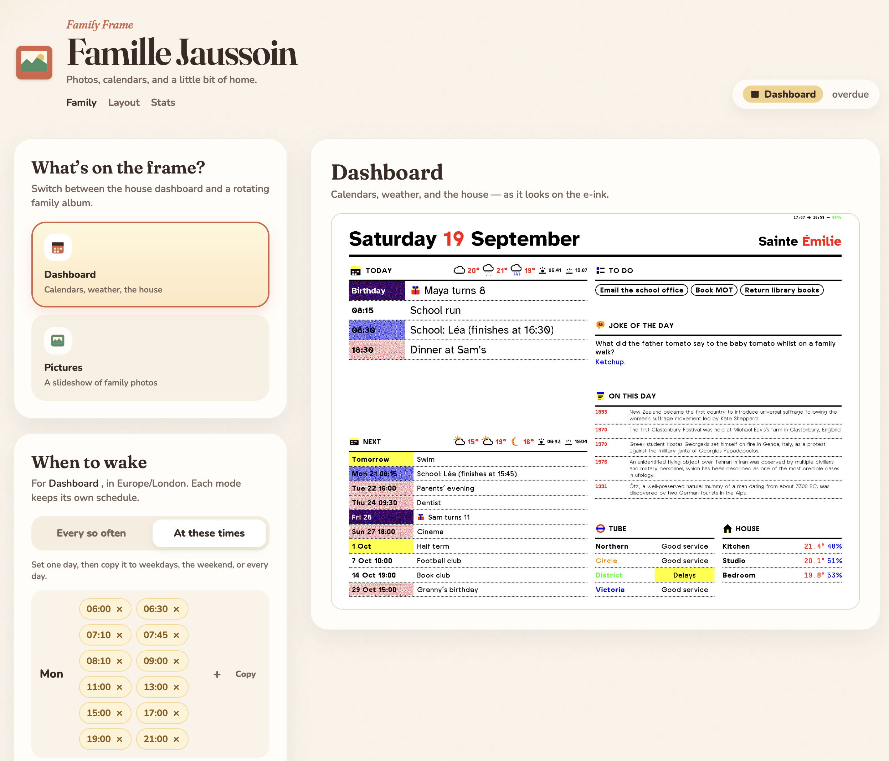
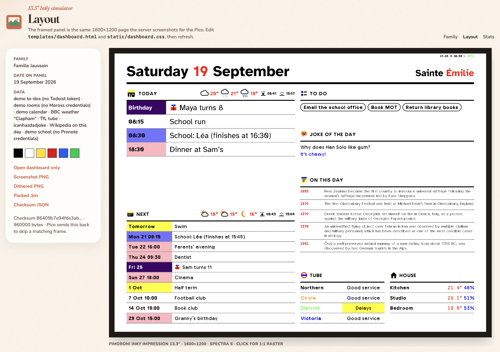

# Family Frame

A colour e-ink kitchen board that lasts **six months on a single charge**.

The picture stays on the glass with the power off. A tiny board on the back wakes on your household schedule, paints a new frame, and goes back to sleep. A server on the LAN gathers the family data and does the rendering. No cable on the wall.

## Six months. One charge.

Wake it for the school run. Sleep through the afternoon. Skip the weekend if you want. If nothing on the board has changed, the glass is not even refreshed.

Charge it twice a year.

The family UI estimates how long this schedule will last from a full pack — idle draw, cost per wake, and the weekday rhythm you actually use.

## The week, at a glance

Calendars, birthdays, the school run, weather in the headings, to-dos, Tube status, room temperatures, a joke, and what happened on this day. Homework and grades stay off the glass unless you ask for them.

## A household board. Or a photo frame.

The same 13.3″ panel is the family dashboard or a rotating album. Switch from the LAN — no app store, no account. Each mode keeps its own wake times, so the album can change more often than the board.

Upload landscape photos, heart the ones that rotate, and preview the dithered Spectra 6 look before it hits the glass.

## What you see is what it paints

The layout is the real 1600×1200 panel. Design it in the browser; the server screenshots that page and dithers it for the e-ink.

## Build one

This is a work in progress. The parts list is in [`shopping.md`](shopping.md). Setup, configuration, and how the pieces talk live in [`docs/setup.md`](docs/setup.md).
